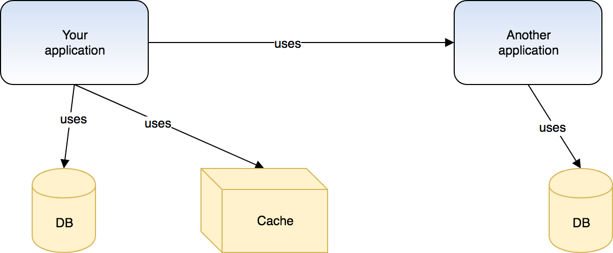
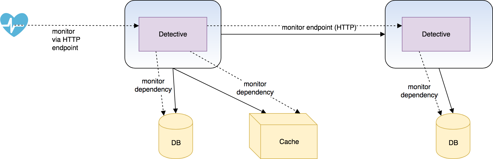

# Detective 🔎

Detective is a distributed application health monitoring library. It allows you to monitor arbitrary dependencies in your application, and compose other detective instances to create a distributed monitoring framework.

## Usage

A typical service oriented architecture looks like this:

<p align="center"></p>

Detective allows you to enable each application to monitor its own dependencies, including dependencies with contain another detective instance. By doing so, you can monitor your infrastructure in a distributed manner, where each service _only_ monitors _it's own_ dependencies.



Detective exposes a straightforward API to monitor an arbitrary dependency:

```go
// Initialize a new detective instance
d := detective.New("Another application")

// Create a dependency, and register its detector function
d.Dependency("cache").Detect(func() error {
        err := cache.Ping()
        return err
})

// Create an HTTP endpoint for health checks
http.ListenAndServe(":8081", d)
```

The HTTP endpoint can then be used to monitor the health of the application. A `GET` request to `http://localhost:8081/` will return information on the health of the overall application:

```json
{
  "name": "Another application",
  "active": true,
  "status": "Ok",
  "latency": 0,
  "dependencies": [
    {
      "name": "cache",
      "active": true,
      "status": "Ok",
      "latency": 500848512
    }
  ]
}
```

This endpoint can also be used by other detective instances. For example, an application that makes use of "Another application" can monitor it as well:

```go
// Create a new detective instance
d := detective.New("your application")

// Add a dependency, and register a function to detect a fault
d.Dependency("database").Detect(func() error {
        // `db` can be an instance of sql.DB
        err := db.Ping()
        return err
})

// Similarly for the cache
d.Dependency("cache").Detect(func() error {
        err := cache.Ping()
        return err
})

// Add an endpoint, which represents another detective instance ("Another application" in this case)
d.Endpoint("http://localhost:8081/")

// Create a ping endpoint which checks the health of all dependencies
// A Detective instance implements the http.Handler interface
http.ListenAndServe(":8080", d)
```

Now, when we hit `GET http://localhost:8080/`, its detective instance will monitor its own dependencies as usual, but _also_ hit the previous dependencies endpoint, and as a result monitor it's dependencies as well :

```json
{
  "name": "your application",
  "active": true,
  "status": "Ok",
  "latency": 0,
  "dependencies": [
    {
      "name": "Another application",
      "active": true,
      "status": "Ok",
      "latency": 0,
      "dependencies": [
        {
          "name": "cache",
          "active": true,
          "status": "Ok",
          "latency": 502210954
        }
      ]
    },
    {
      "name": "db",
      "active": true,
      "status": "Ok",
      "latency": 2500328773
    },
    {
      "name": "db",
      "active": true,
      "status": "Ok",
      "latency": 2500248450
    }
  ]
}
```