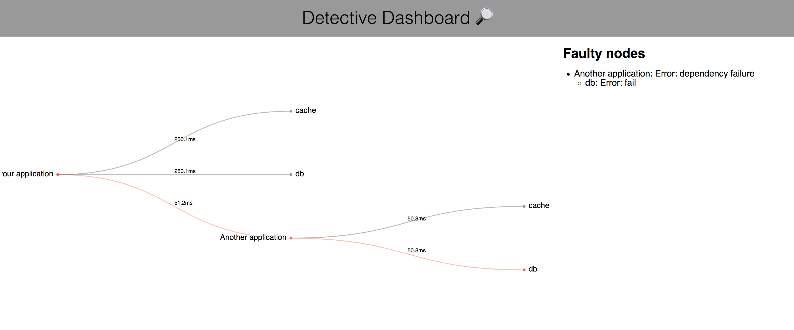

# Detective 🔎

[](https://travis-ci.org/sohamkamani/detective) [](https://godoc.org/github.com/sohamkamani/detective) [](https://coveralls.io/github/sohamkamani/detective?branch=master)

Detective is a distributed application health monitoring library. It allows you to monitor arbitrary dependencies in your application, and compose other detective instances to create a distributed monitoring framework.

- [Detective 🔎](#detective-%F0%9F%94%8E)
  - [Usage](#usage)
    - [Monitoring a single application](#monitoring-a-single-application)
    - [Composing instances](#composing-instances)
    - [Circular dependencies](#circular-dependencies)
  - [Dashboard](#dashboard)
  - [Examples](#examples)
  - [API documentation](#api-documentation)
  - [Other implementations](#other-implementations)

## Usage

A typical service oriented architecture looks like this:

<p align="center"></p>

Detective allows you to enable each application to monitor its own dependencies, including dependencies with contain another detective instance. By doing so, you can monitor your infrastructure in a distributed manner, where each service _only_ monitors _it's own_ dependencies.


### Monitoring a single application

Detective exposes a straightforward API to monitor an arbitrary dependency:

```go
// Initialize a new detective instance
d := detective.New("Another application")

// Create a dependency, and register its detector function
d.Dependency("cache").Detect(func() error {
        err := cache.Ping()
        return err
})

// Create an HTTP endpoint for health checks
http.ListenAndServe(":8081", d)
```

[See the "regular usage" example](sample/regular-usage/main.go)

The HTTP endpoint can then be used to monitor the health of the application. A `GET` request to `http://localhost:8081/` will return information on the health of the overall application:

```json
{
  "name": "Another application",
  "active": true,
  "status": "Ok",
  "latency": 0,
  "dependencies": [
    {
      "name": "cache",
      "active": true,
      "status": "Ok",
      "latency": 500848512
    }
  ]
}
```

### Composing instances

The endpoint in the previous example can also be used by other detective instances. For example, an application that makes use of "Another application" can monitor it as well:

```go
// Create a new detective instance
d := detective.New("your application")

// Add a dependency, and register a function to detect a fault
d.Dependency("database").Detect(func() error {
        // `db` can be an instance of sql.DB
        err := db.Ping()
        return err
})

// Similarly for the cache
d.Dependency("cache").Detect(func() error {
        err := cache.Ping()
        return err
})

// Add an endpoint, which represents another detective instance ("Another application" in this case)
d.Endpoint("http://localhost:8081/")

// Create a ping endpoint which checks the health of all dependencies
// A Detective instance implements the http.Handler interface
http.ListenAndServe(":8080", d)
```

[See the "composing detective instances" example](sample/composing-detective-instances/main.go)

Now, when we hit `GET http://localhost:8080/`, its detective instance will monitor its own dependencies as usual, but _also_ hit the previous dependencies endpoint, and as a result monitor it's dependencies as well :

```json
{
  "name": "your application",
  "active": true,
  "status": "Ok",
  "latency": 0,
  "dependencies": [
    {
      "name": "Another application",
      "active": true,
      "status": "Ok",
      "latency": 0,
      "dependencies": [
        {
          "name": "cache",
          "active": true,
          "status": "Ok",
          "latency": 502210954
        }
      ]
    },
    {
      "name": "db",
      "active": true,
      "status": "Ok",
      "latency": 2500328773
    },
    {
      "name": "db",
      "active": true,
      "status": "Ok",
      "latency": 2500248450
    }
  ]
}
```

### Circular dependencies

It's possible for two applications to depend on each other, either directly, or indirectly. Normally, if you registered two detective instances as dependents of each other, it would result in an infinite loop of HTTP calls to each others ping handler. Detective protects against this situation by adding information about a calling instance to the HTTP header of its request. The callee then inspects this header to find out if it was already part of the calling chain, in which case it ceases to send endpoint HTTP requests, and breaks the circular dependency chain.

## Dashboard

The dashboard helps visualize your dependency tree and detect any faulty dependencies, along with their latency:



To run the dashboard, install the binary with:

```
go get github.com/sohamkamani/detective/detective-dashboard
go install github.com/sohamkamani/detective/detective-dashboard
```

Then start the dashboard with:

```
detective-dashboard -p 8080
## Starts dashboard on http://localhost:8080/
```

You will then have to enter the URL of any detective endpoint to view its dashboard.

## Examples

- [Regular usage]((sample/regular-usage/main.go))
- [Composing instances](sample/composing-detective-instances/main.go)

## API documentation

Detailed API documentation can be found on the [GoDocs page]((https://godoc.org/github.com/sohamkamani/detective)

## Other implementations

The detective library has also been implemented in Node.js : [https://github.com/sohamkamani/detective-node](https://github.com/sohamkamani/detective-node), is iteroperable with this implementation, and can be used as an endpoint.